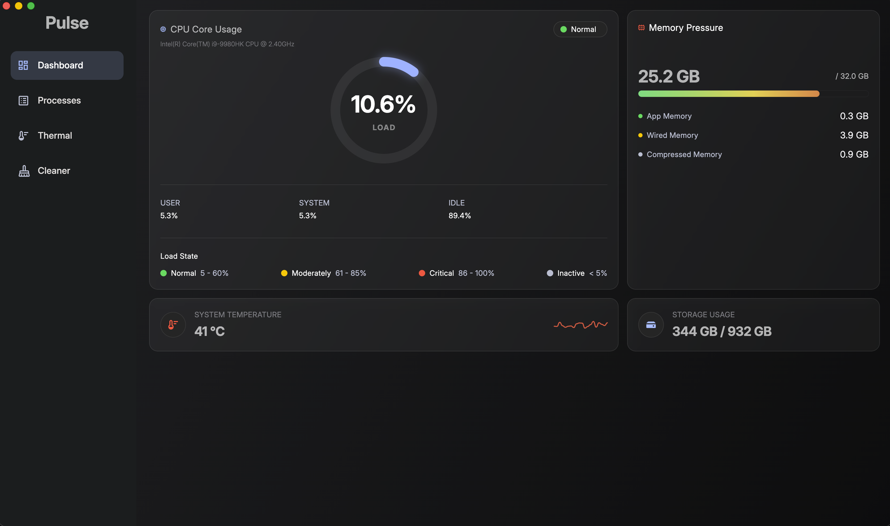

# Pulse

A real-time macOS system monitor built with Flutter Desktop.



## Features

- **Dashboard** — real-time CPU load (circular gauge), memory usage (horizontal bar + breakdown), storage info, and temperature with sparkline history
- **Sidebar navigation** — switch between Dashboard, Processes, Thermal, and Cleaner views with animated transitions
- **Live polling** — all system metrics refresh every second via native macOS APIs through Flutter MethodChannels
- **Process list** — sortable, searchable table of running processes with CPU, memory, and user info, updated every 2 seconds
- **Safe process termination** — terminate processes via AppleScript/System Events (not `kill()` syscall), keeping the app sandboxed and App Store–ready
- **Dark theme** — glassmorphism cards with custom gradient background

### Planned

- Thermal view (throttling state)
- Cleaner view (cache and temp file cleanup)

## Tech Stack

| Layer | Technology |
|---|---|
| **Framework** | Flutter Desktop (macOS) |
| **State management** | flutter_bloc (Bloc pattern) |
| **Architecture** | Clean Architecture (data / domain / ui) |
| **Dependency injection** | get_it (lazy singletons + factories) |
| **Localization** | easy_localization (English) |
| **Icons** | flutter_svg (custom SVG set) |
| **Native bridge** | Flutter MethodChannel (Swift) |
| **Target** | macOS 10.15+ (sandboxed) |

## Architecture

```
lib/
├── core/                     # Shared across features
│   ├── dependency_injection/ # GetIt registrations
│   ├── domain/enums/         # Cross-cutting enums
│   ├── extensions/           # doublex, widgetx
│   ├── theme/                # Colors, fonts, ThemeData
│   └── ui/widgets/           # Reusable widgets
│
└── features/
    ├── dashboard/            # Fully implemented
    │   ├── data/             # Datasources, models, repos
    │   ├── domain/           # Entities, use cases, repo interfaces
    │   └── ui/               # Bloc, view, parts, widgets
    │
    ├── main/                 # Navigation shell
    │   └── ui/               # Bloc, page, sidebar
    │
    ├── cleaner/              # Stub
    ├── processes/            # Stub
    └── thermal/              # Stub
```

Each feature follows the same data flow: **UI → Bloc → UseCase → Repository → DataSource → MethodChannel → macOS**.

## Requirements

- macOS 10.15 or later
- Flutter SDK 3.11+
- Xcode 15+

## Getting Started

```bash
# Clone the repository
git clone https://github.com/your-username/pulse.git
cd pulse

# Install dependencies
flutter pub get

# Run on macOS
flutter run -d macos
```

## Build

```bash
flutter build macos
```

The app is sandboxed by default (`com.apple.security.app-sandbox`).

## Process Termination

The **Processes** view allows terminating running processes, but it does **not** use the Unix `kill()` syscall. Instead, it uses a two-step AppleScript approach:

1. **Resolve the app name** from System Events (read-only lookup by PID)
2. **Send `quit` directly** to the target application

```
-- Step 1: get the app name
tell application "System Events"
    set appName to name of first process whose unix id is <PID>
    return appName
end tell

-- Step 2: quit the app directly
tell application "<appName>"
    quit
end tell
```

This approach has several advantages:

- **Sandbox-compatible**: it only requires the `com.apple.security.temporary-exception.apple-events` entitlement targeting `com.apple.systemevents`, which is accepted on the Mac App Store.
- **Direct permission prompts**: macOS asks "Pulse wants to quit \<App\>" — a clear, user-understandable request — rather than going through System Events as an intermediary.
- **Safe by design**: System Events only manages GUI applications. Background daemons, kernel threads, and system processes are invisible to it, so they cannot be killed — a natural safeguard against accidental system damage.
- **Respects the app's quit handler**: `quit` sends a standard quit Apple Event, giving the application a chance to save data before closing.

The flow is: **UI confirmation dialog → Bloc → KillProcessUseCase → Repository → DataSource → MethodChannel → Swift → NSAppleScript → resolve name → quit target app**.

## Project Status

**Active development.** The Dashboard feature is complete and functional. Processes, Thermal, and Cleaner views are stubs awaiting implementation.
